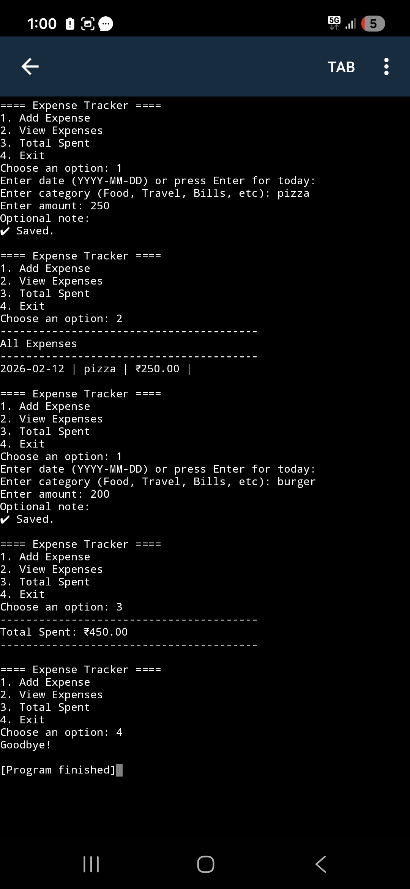

# Expense Tracker CLI App (Python)

A command-line application to track daily expenses.

## Features
- Add expenses
- View expenses
- Calculate total spending

## Tech Stack
Python, CSV

## How to Run
Download the code and run:

python main.py

## Sample Output

### Adding Expenses

### Viewing Expenses

### Total Spent

